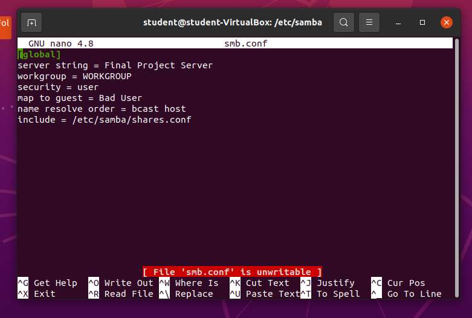
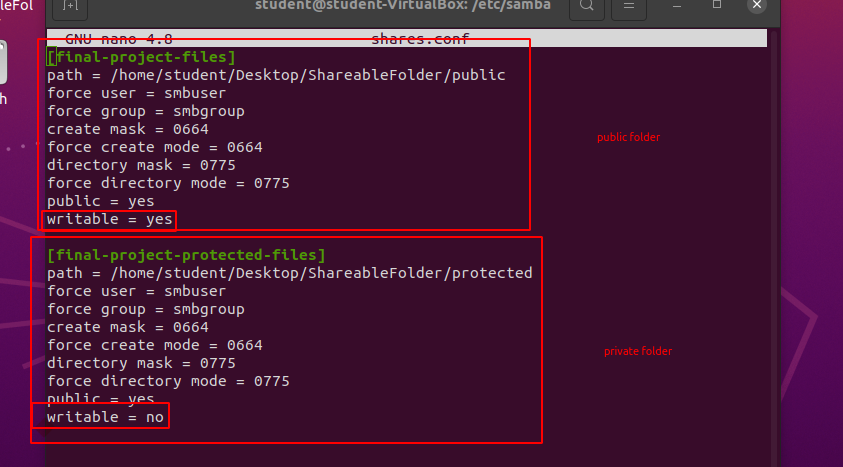
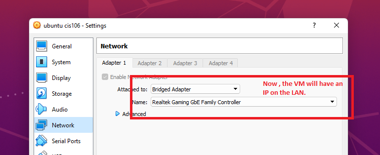

# Second Deliverable

I had many issues along the process of building the server. I opted to create a config file from zero.
I follow some steps from a tutorial that helped me creating credentials to my server.
Also , it helped me with the permissions.

I decided to create two folders:

### Public Folder:
 In this folder , any user can write or delete any file. This folder should not have important files.

### Protected Folder:
In this folder , Files are protected and only readable. The guest user does not have any control over the files.

Everything should was running fine. However, i had the most important issue. 

### How can i get access to the folder from another computer?

I tried finding the virtual machine on my Local Area Network.

I could not find it.

I used "ifconfig" on the VM and realized that the ip was "10.0.0.15".
However , the default gateway of my LAN is "192.168.1.1" subnet "255.255.255.0 " so i can assume that the ip's of my LAN should be "192.168.1.XXX".
What does this mean? My VM is not in the same network.

This is because the VM Software is set to use my host computer as a Gateway.

Now the file server is working on the LAN NETWORK.

I am aiming to share the folder over the net including more security for the final deliverable.