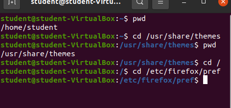

# Lab 3 | Installing software and navigating the file system | Answers
Assignment description [here](https://raw.githubusercontent.com/ra559/cis106/main/labs/lab3.md)

## Question 1
1. Which command did you use to search for the themes and to install them?
   I used the APT SEARCH command. APT SEARCH THEME.
   To install them SUDO APT INSTALL nameofthetheme
   
2. Which commands did you use to find and install the web browser?
   APT SEARCH BROWSER
   SUDO APT INSTALL nameofthebrowser
   
3. Use the command line to find a 3D or 2D racing game. Answer the following questions about the game:
   
3.1 What is the name of the package?
    Its name is trophy.

3.2 What dependencies are needed in order to install the package? (you can either take a screenshot of the terminal or copy and paste from the terminal)

3.3 How much disk space will the package utilize after installation?
 51.7mb after installation will be used.

## Question 2

## Question 3

## Question 4

## Question 5
