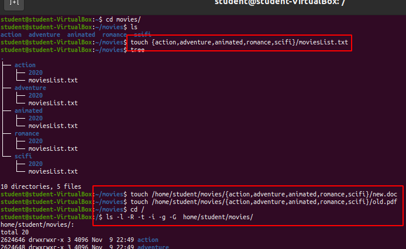

# Lab 4 | Managing files and directories
 ## Question 1: Creating directories

 ## Question 2: Creating files

 ## Question 3: Removing files

 ## Question 4: Moving files and directories

 ## Question 5: Copying files

