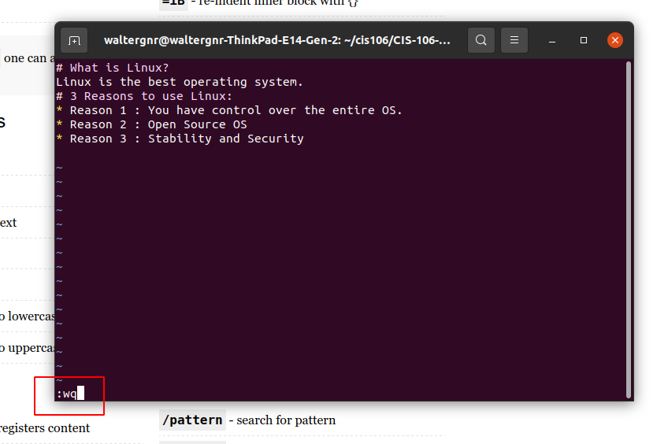
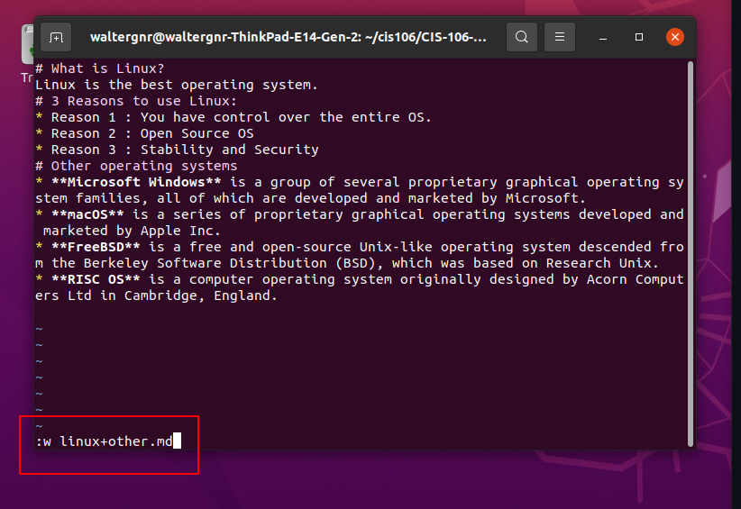
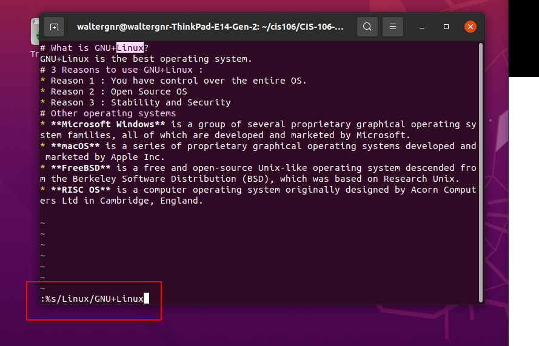
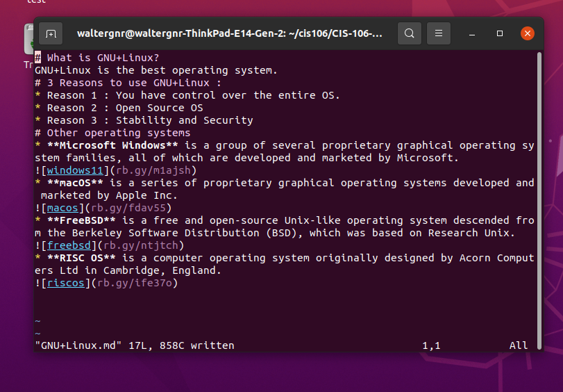

## One 

## two 

## three 

## Four 

## URL 
    https://github.com/WalterGnr/CIS-106/blob/main/lab6/GNU%2BLinux.md

    https://github.com/WalterGnr/CIS-106/blob/main/lab6/linux%2Bother.md

    https://github.com/WalterGnr/CIS-106/blob/main/lab6/linux.md