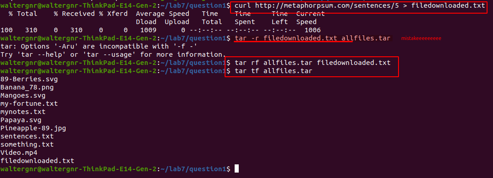

# Lab 7 | Managing Data

## Question 1 | Tar Utility
1. In the `question1` directory, you will find a bunch of files. Create an archive called `allfiles.tar` that includes:
   1. All text files
   2. All images that have a number in their file names
   3. All video files

2. List all the members of the archive.
    
3. Create another text file with some text. Use the command `lorem` to generate the text and then output redirection to save it to a file. If the lorem command does not work, it means that you need to install it. The package name is: `libtext-lorem-perl`
If the package is not available use the following command and redirect its output to a file: `curl http://metaphorpsum.com/sentences/5`
4. Add the new file to the archive.
5. List all the members of the archive.
    

## Question 2 | Cpio Utility
1. Move the `allfiles.tar` archive from question 1 to the question2 directory and extract all the files.
2. Remove the archive and create a new archive with cpio of all the files.
   
3. Create a tar archive with cpio of all the files including the cpio archive.
4. Remove all the files except the tar archive.
5. Extract all the archive using cpio
   

## Question 3 | Gzip, bzip2, xz
1. In the question3 directory you will find 1 file called `mynotes.txt`. What is the size of this file?
2. Compress `mynotes.txt`. using gzip keeping the original file.
3. Compress `smynotes.txt`. using bzip2 keeping the original file.
4. Compress `smynotes.txt`. using xz keeping the original file.
5. Long list all the files. Which tool gave you the best compression?
   

## Question 4 | Zip, 7zip and Rar
1. Decompress all the compressed files from question 3 in the `question4` directory. Make sure to rename the file after decompressing them.
2. Using zip, create a zip archive of all the files.
   
3. Create a 7zip archive of all the files.
   
4. Create a rar archive using 7zip of all the files.
5. Long list all the archives. Which one gave you the best compression ratio?
   
