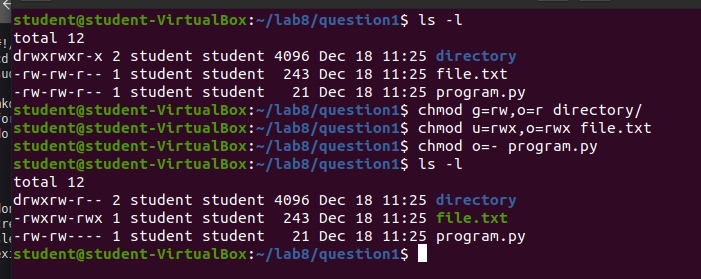
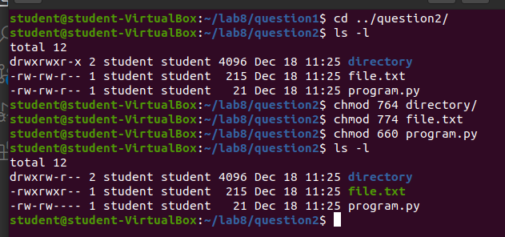
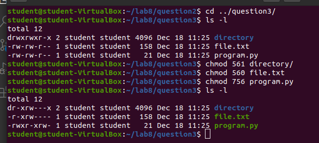
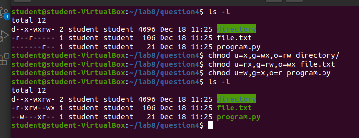

# Lab 8: File Permissions

## Question 1 | Use symbolic notation
1. Long list all the files in directory1. 
2. Modify the files permissions such that:

| Type of file | Owner | Group | Other|
|--------------|-------|-------|------|
| Directory    |rwx    |rw-    |r--   |
| Image        |rw-    |r-x    |---   |
| Python       |rw-    |rw-    |---   |
| Text         |rwx    |rwx    |r--   |
 

3. Long list all the files in directory1

## Question 2 | Use numeric notation
1. Long list all the files in directory2.
2. Modify the files permissions such that:

| Type of file | Owner | Group | Other|
|--------------|-------|-------|------|
| Directory    |rwx    |rw-    |r--   |
| Image        |rw-    |r-x    |---   |
| Python       |rw-    |rw-    |---   |
| Text         |rwx    |rwx    |r--   |

3. Long list all the files in directory2

## Question 3 | Use numeric notation
1. Long list all the files in directory3
2. Modify the files permission such that:

| Type of file | Owner | Group | Other|
|--------------|-------|-------|------|
| Directory    |r-x    |rw-     |--X  |
| Image        |rwx    |rwx     |rwx  |
| Python       |rwx    |r-x     |rw-  |
| Text         |r-x    |rw-     |---  |

3. Long list all the files in directory3

## Question 4 | Use symbolic notation
1. Long list all the files in directory4
2. Modify the files permission such that:

| Type of file | Owner | Group | Other|
|--------------|-------|-------|------|
| Directory    |--X    |-wx    |rw-   |
| Image        |rwx    |r-x    |---   |
| Python       |-w-    |--X    |r--   |
| Text         |r-x    |r-w    |-wx   |

3. Long list all the files in directory4

